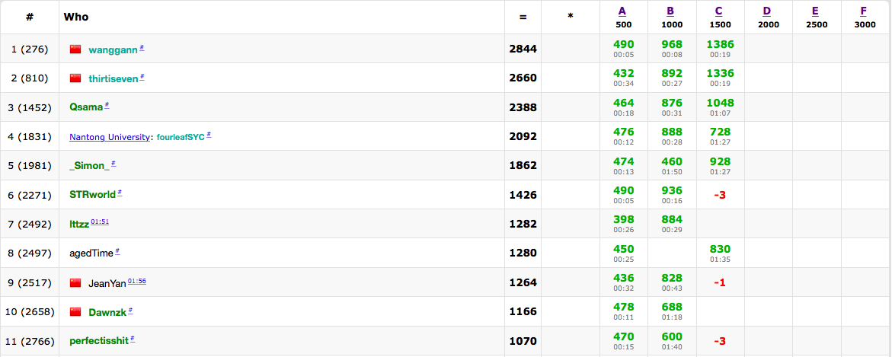
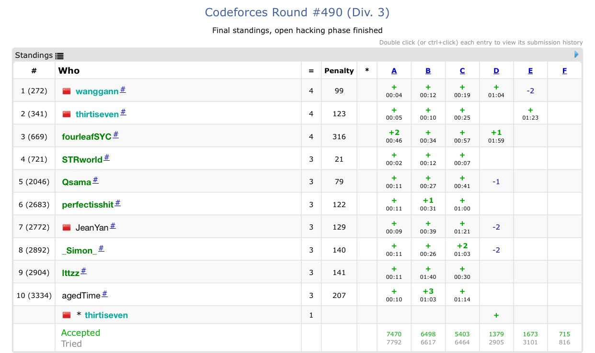

-   I. 沈逸淳(+30)
-   II. 李昊洋(+20)
-   III. 王淦(+10)

-   2018 5.26

   Simon + 30

STRworld + 20

Ittzz + 10

-   2018.07.09		Codeforces Round #495 (Div 2) 15:30 ~ 17:30 rated

-   2018.07.12		Codeforces Round #490 (Div 3) 15:30 ~ 17:30 Rated

- 2018.07.12		Codeforces Round #497 (Div 2) 22:35 ~ 24:35 Rated

  Qsama +30

  _SImon_ +20

  perfectisshit +10

- 2018.7.15 ECL-Final

    Simon wanggann thirtiseven +10

    perfectisshit Qsama Dawnzk +8

    Ittzz Jeanyan STRworld + 4

- 2018 7.18 484div2

    wanggann +30

    thirtiseven + 20

    _Simon + 10

- 2018 7.23 486 div3

    perfectisshit +30

    STRworld + 20

    _Simon +10

- 2018 7.25 481 div3

    fourleafSYC +30

    JeanYan +20

    _Simon +10

- 2018.8.1 ABC102&&ARC100 

    Wanggann +30

    thirtiseven +20

    AgedTime +10

- 2018.8.3 [2015 ACM Amman Collegiate Programming Contest](http://codeforces.com/gym/100712)

    Simon wanggann thirtiseven +10

    Qsama +20

    STRWorld Dawnzk perfectshit + 4

- 2018.8.6 2018多校3 HDUcontest

    Simon wanggann thirtiseven +10

    JeanYan SYC agedTime + 8

    Qsama Ittzz +5